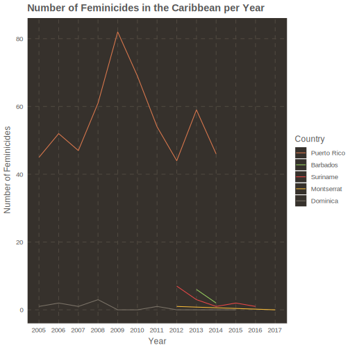
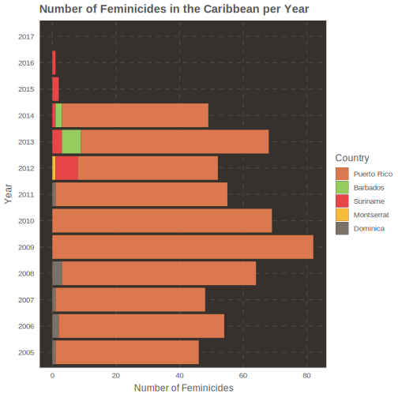
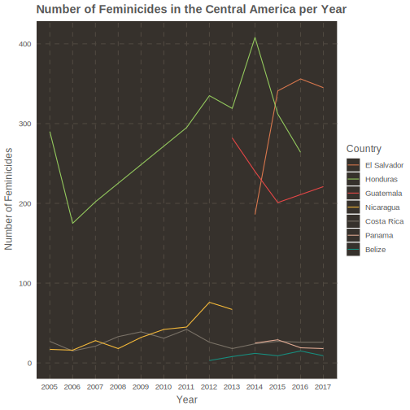
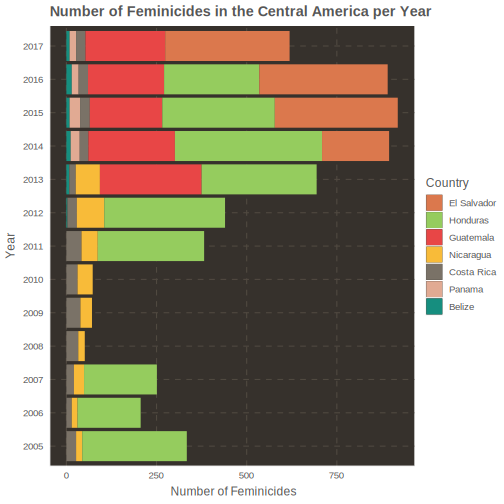
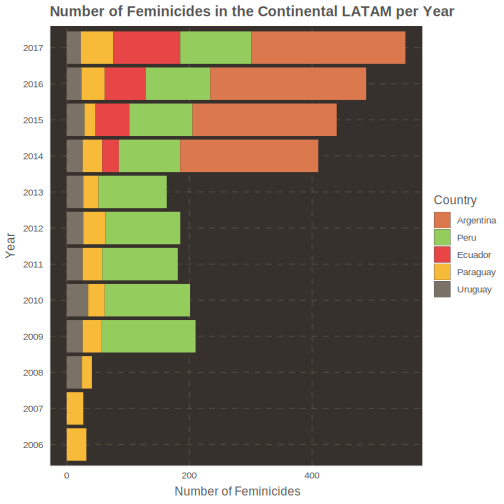
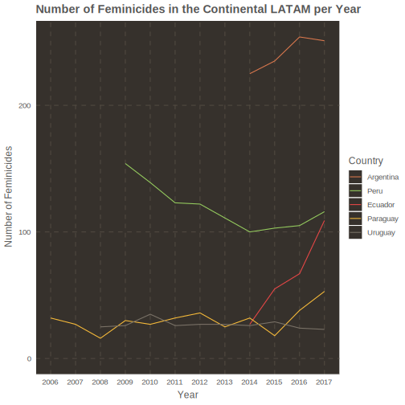

## Context

According to statistics from the Puerto Rico Police Department, reported this week in a newspaper from Puerto Rico, there's been 21 women killed by their partners or ex-partners in 2018 in the island. [1] Feminist collectives have expressed that the total feminicide count is around 40 women. However, how do we define feminicide? The *Femicide Across Europe Network*, a project financed by the European Union to study feminicides, defines them as "the intentional killing of females (women or girls) because they are females". [2] One of the problems when handling these cases is the lack of specific protocols to handle the different types of cases. Dr. Rita Laura Segato has studied this processes for years and explains that different types of violence against women are confused with one another and thus englobed in a category of passional crimes or relationship/love crimes. This over-simplification of the process makes it harder to understand the causes and circumstances behind each case. It also has the effect of diminishing the perception of the rising number of cases that occur outside relationships. She has suggested creating more specific definitions of the different sub-types of feminicides to handle this englobing of the cases. [3]

Given this, I wanted to look at the trends of feminicides in the Caribbean and Latin America. The Economic Comission for Latin America and the Caribbean from the United Nations (CEPAL, by its Spanish itinials) has been collecting the total number of cases in each country per year and makes it available through XML documents. [4] I parsed this documents to extract the data, visualize it and make it accesible to researchers, non-profits and governments. I divided the data in 3 regions to handle it with more detail, the Caribbean, Central America, and the countries in the continental Latin America. For the Caribbean region, the CEPAL only had data for five countries, of which only one is from the Greater Antilles. For the Central America region the CEPAL had data for seven countries with El Salvador having the highest number in 2017 in all Latin America with 345 women killed. For the continental countries, the CEPAL had data for five countries as well. From these countries, only Argentina, Paraguay, and Peru had a specialized register for feminicides. One of the things that could be investigated further is if it is more helpful to have Police Departments or specialized registers collect and analyze this data to design intervention programs to address this problematic.  

## Data Available

### Data for the Caribbean

For the Caribbean we have data for five countries:

| Country | Years Available |
|:-------:|:---------------:|
| Dominica | 2005 - 2015 |
| Puerto Rico | 2005 - 2014 |
| Suriname | 2012 - 2016 |
| Montserrat | 2012, 2017 |
| Barbados | 2013 - 2014 |

```{r setup, include=FALSE}
knitr::opts_chunk$set(echo = FALSE, warning = FALSE, message = FALSE)
library(tidyverse)
```


</br>
</br>

</br>
</br>

```{r}
data <- read_csv('data/caribbean_countries.csv')
```

```{r}
DT::datatable(data, 
              rownames = FALSE, 
              colnames = c('Country', 'ISO3', 'Year', 'Cases', 'Source'),
              caption = htmltools::tags$caption(
                  style = 'caption-side: top; text-align: center;',
                  'Data for Caribbean Countries'), 
              filter = 'top', 
              extensions = c('Buttons', 'Responsive'), 
              options = list(
                  dom = 'Brtip',
                  buttons = c('copy', 'csv', 'pdf', 'print'))
              )
```

### Data for Central America

For Central America we have data for seven countries:

| Country | Years Available |
|:-------:|:---------------:|
| Nicaragua | 2005 - 2013 |
| Honduras | 2005 - 2016 |
| Costa Rica | 2005 - 2017 |
| Belize | 2012 -2017 |
| Guatemala | 2013 - 2017 |
| Panama | 2014 - 2017 |
| El Salvador | 2014 - 2017 |


</br>
</br>

</br>
</br>

```{r}
data <- read_csv('https://raw.githubusercontent.com/ian-flores/feminicidesLATAM/master/data/central-america_countries.csv')
```

```{r}
DT::datatable(data, 
              rownames = FALSE, 
              colnames = c('Country', 'ISO3', 'Year', 'Cases', 'Source'),
              caption = htmltools::tags$caption(
                  style = 'caption-side: top; text-align: center;',
                  'Data for Central American Countries'), 
              filter = 'top', 
              extensions = c('Buttons', 'Responsive'), 
              options = list(
                  dom = 'Brtip',
                  buttons = c('copy', 'csv', 'pdf', 'print'))
              )
```

### Data for Continental Latin America

For the Continental Latin America we have data for five countries:

| Country | Years Available |
|:-------:|:---------------:|
| Paraguay | 2006 - 2017 |
| Uruguay | 2008 - 2017 |
| Peru | 2009 - 2017 |
| Argentina | 2014 - 2017 |
| Ecuador | 2014 - 2017 |


</br>
</br>

</br>
</br>

```{r}
data <- read_csv('https://raw.githubusercontent.com/ian-flores/feminicidesLATAM/master/data/continental-latam_countries.csv')
```

```{r}
DT::datatable(data, 
              rownames = FALSE, 
              colnames = c('Country', 'ISO3', 'Year', 'Cases', 'Source'),
              caption = htmltools::tags$caption(
                  style = 'caption-side: top; text-align: center;',
                  'Data for Continental Latin American Countries'), 
              filter = 'top', 
              extensions = c('Buttons', 'Responsive'), 
              options = list(
                  dom = 'Brtip',
                  buttons = c('copy', 'csv', 'pdf', 'print'))
              )
```

## References

[1] - https://www.elnuevodia.com/noticias/seguridad/nota/aumentanlosfeminicidios-2459479/

[2] - https://www.femicide.net/mc

[3] - http://mujeresdeguatemala.org/wp-content/uploads/2014/06/Femigenocidio-y-Feminicidio.pdf

[4] - https://www.cepal.org/en

## License

<a rel="license" href="http://creativecommons.org/licenses/by-sa/4.0/"></a><br />This work is licensed under a <a rel="license" href="http://creativecommons.org/licenses/by-sa/4.0/">Creative Commons Attribution-ShareAlike 4.0 International License</a>.

### Other Works

If you are interested in reading more quantitative analyses about social situations you can follow my page:
https://www.bayesianpolitik.me