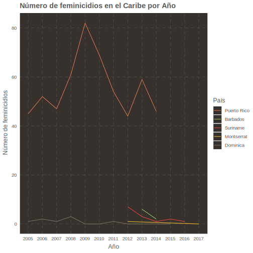
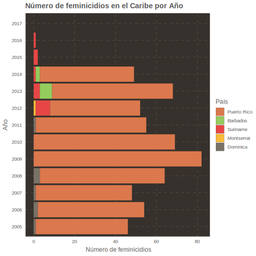
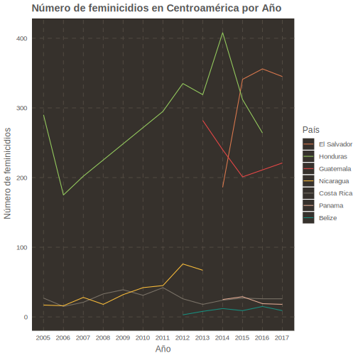
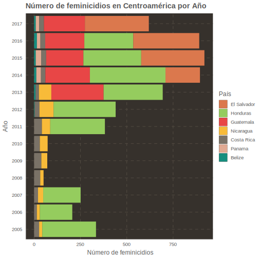
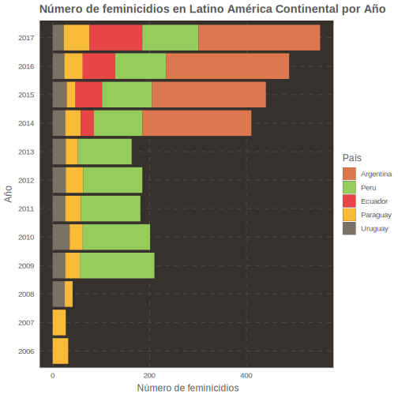
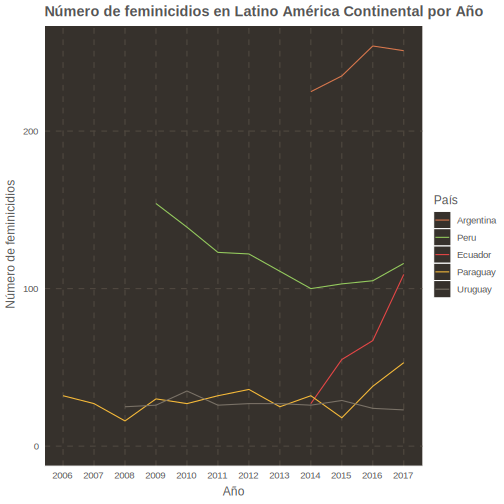

## Contexto

De acuerdo a estadísticas de la Policía de Puerto Rico, reportadas esta semana en un periódico de la isla, han 21 mujeres han sido asesinadas por sus parejas o ex-parejas en el 2018 en la isla. [1] Colectivas feministas han expresado que la cifra total de feminicidios puede estar alrededor de 40 mujeres. Sin embargo, como definimos feminicidio? La *Femicide Across Europe Network*, un proyecto financiado por la Unión Europea para estudiar los feminicidios, los define como “el asesinato de mujeres (adultas o niñas) por el hecho de ser mujeres”. [2] Uno de los problemas al manejar estos casos es la falta de protocolos específicos para manejar los diferentes tipos de casos. La Dra. Rita Laura Segato ha estudiado estos procesos por años y explica que diferentes tipos de violencia contra las mujeres son confundidos unos con los otros y terminan siendo englobados en una categoría de crímenes pasionales o de crímenes del hogar. Esta sobre-simplificación del proceso hace más difícil comprender las causas y las circunstancias detrás de cada caso. A su vez, tiene el efecto de disminuir la percepción del número de casos que ocurren fuera de las relaciones. Segato también ha sugerido crear definiciones más específicas sobre los diferentes sub-tipos de feminicidios para manejar estos problemas.[3]


Dado esto, me interese en analizar las tendencias de feminicidios en el Caribe y en Latino América. La Comisión Económica Para América Latina y el Caribe de las Naciones Unidas (CEPAL) ha estado compilando el número total de casos en cada país por año y lo ha hecho disponible en documentos en formato XML. Obtuve los documentos para extraer los datos, visualizarlos, y hacerlos disponibles han investigador+s, organizaciones sin fines de lucro y gobiernos. Divide los datos en tres regiones para manejarlos en más detalle, el Caribe, Centroamérica, y los países en Latino América continental. Para la región del Caribe, la CEPAL solo tenía datos para cinco (5) países, de los cuales solo uno (1) era de las Antillas Mayores. Para la región de Centroamérica, la CEPAL tenía datos para siete (7) países, con El Salvador teniendo el número de feminicidios más alto en el 2017 para toda América Latina con 345 mujeres asesinadas. Para los países continentales, la CEPAL solo tenía datos para cinco (5) países. De estos paises, solo Argentina, Paraguay, y Perú tienen registros especializados en feminicidios. Una de las cosas que podría ser investigadas en mayor profundidad es si es de mayor beneficio el que los departamentos de la policía o los registros especializados, recojan y analizen los datos para diseñar programas de intervención que atiendan esta problemática.

## Datos Disponibles

### Datos para el Caribe

Para el Caribe tenemos datos para cinco (5) países:

| País | Años Disponibles |
|:-------:|:---------------:|
| Dominica | 2005 - 2015 |
| Puerto Rico | 2005 - 2014 |
| Suriname | 2012 - 2016 |
| Montserrat | 2012, 2017 |
| Barbados | 2013 - 2014 |

```{r setup, include=FALSE}
knitr::opts_chunk$set(echo = FALSE, warning = FALSE, message = FALSE)
library(tidyverse)
```


</br>
</br>

</br>
</br>

```{r}
data <- read_csv('data/caribbean_countries.csv')
```

```{r}
DT::datatable(data, 
              rownames = FALSE, 
              colnames = c('País', 'ISO3', 'Año', 'Casos', 'Fuente'),
              caption = htmltools::tags$caption(
                  style = 'caption-side: top; text-align: center;',
                  'Datos para el Caribe'), 
              filter = 'top', 
              extensions = c('Buttons', 'Responsive'), 
              options = list(
                  dom = 'Brtip',
                  buttons = c('copy', 'csv', 'pdf', 'print'))
              )
```

### Datos para Centroamérica

Para Centroamérica tenemos datos para 7 países: 

| País | Años Disponibles |
|:-------:|:---------------:|
| Nicaragua | 2005 - 2013 |
| Honduras | 2005 - 2016 |
| Costa Rica | 2005 - 2017 |
| Belize | 2012 -2017 |
| Guatemala | 2013 - 2017 |
| Panama | 2014 - 2017 |
| El Salvador | 2014 - 2017 |


</br>
</br>

</br>
</br>

```{r}
data <- read_csv('https://raw.githubusercontent.com/ian-flores/feminicidesLATAM/master/data/central-america_countries.csv')
```

```{r}
DT::datatable(data, 
              rownames = FALSE, 
              colnames = c('País', 'ISO3', 'Año', 'Casos', 'Fuente'),
              caption = htmltools::tags$caption(
                  style = 'caption-side: top; text-align: center;',
                  'Datos para Centroamérica'), 
              filter = 'top', 
              extensions = c('Buttons', 'Responsive'), 
              options = list(
                  dom = 'Brtip',
                  buttons = c('copy', 'csv', 'pdf', 'print'))
              )
```

### Datos para Latino América Continental

Para Latino América Continental tenemos datos para cinco (5) países:

| País | Años Disponibles |
|:-------:|:---------------:|
| Paraguay | 2006 - 2017 |
| Uruguay | 2008 - 2017 |
| Peru | 2009 - 2017 |
| Argentina | 2014 - 2017 |
| Ecuador | 2014 - 2017 |


</br>
</br>

</br>
</br>

```{r}
data <- read_csv('https://raw.githubusercontent.com/ian-flores/feminicidesLATAM/master/data/continental-latam_countries.csv')
```

```{r}
DT::datatable(data, 
              rownames = FALSE, 
              colnames = c('País', 'ISO3', 'Año', 'Casos', 'Fuente'),
              caption = htmltools::tags$caption(
                  style = 'caption-side: top; text-align: center;',
                  'Datos para Latino América Continental'), 
              filter = 'top', 
              extensions = c('Buttons', 'Responsive'), 
              options = list(
                  dom = 'Brtip',
                  buttons = c('copy', 'csv', 'pdf', 'print'))
              )
```

## Referencias

[1] - https://www.elnuevodia.com/noticias/seguridad/nota/aumentanlosfeminicidios-2459479/

[2] - https://www.femicide.net/mc

[3] - http://mujeresdeguatemala.org/wp-content/uploads/2014/06/Femigenocidio-y-Feminicidio.pdf

[4] - https://www.cepal.org/en

## Licencia

<a rel="license" href="http://creativecommons.org/licenses/by-sa/4.0/"></a><br />Este trabajo tiene una licensia bajo <a rel="license" href="http://creativecommons.org/licenses/by-sa/4.0/">Creative Commons Attribution-ShareAlike 4.0 International License</a>.

### Otros Trabajos

Si le interesa leer más análisis cuantitativos sobre situaciones sociales puede seguir mi página: https://www.bayesianpolitik.me